# AI-driven Topographic Map Generation

Automated generation of Swiss-style topographic maps from aerial imagery using Google’s Gemini AI (NanoBanana).

## Motivation

This project originated from exploring whether generative AI could transform aerial photographs into professional topographic map renderings that match Swiss cartographic standards. The initial [LinkedIn experiment](https://www.linkedin.com/feed/update/urn:li:activity:7379129420801875968/) demonstrated promising results for single images. This repository extends that work to test **scalability, consistency, and automation** across larger map areas. With all the feedback I got and a deep dive in the [Gemini API for image style transfer](https://ai.google.dev/gemini-api/docs/image-generation#3_style_transfer), I adapted the [prompt](prompt.txt) which you can use  directly  in an AI which has NanoBanana integerated such [GEMINI](https://gemini.google.com/app). In GEMINI make sure, you activated "Create Image" when processing the Input

## Research Question

Can we reliably generate Swiss-style topographic map visualizations from SWISSIMAGE aerial photography using AI, maintaining cartographic consistency across multiple map tiles?

## Key Findings

### What Works Well

✅ **Geometric Precision**: The AI maintains high positional accuracy, correctly placing geographic features  
✅ **Style Recognition**: Strong fidelity to cartographic conventions (colors, symbols, layering)  
✅ **Information Extraction**: Good detection of roads, trees and buildings  
✅ **Automation Feasibility**: Workflow is reproducible and can process multiple tiles systematically  

### Current Limitations

⚠️ **Consistency Challenges**: Generated interpretations vary between tiles, creating visual discontinuities  
⚠️ **Incomplete Processing**: Not all aerial imagery elements are consistently interpreted: vegetation and water bodies (greenish small ponds), use of NIR imagery might help
⚠️ **Style Variations**: The AI doesn't always apply the same cartographic style across the entire area  
⚠️ **Transient Objects**: Cars and temporary features are not always automatically removed  

### Overall Assessment

The approach shows **significant potential** for automated cartographic visualization. While not production-ready, results demonstrate that AI can understand and translate aerial imagery into recognizable map styles with reasonable accuracy... and definitely gives a taste of things to come in the coming months (not years!)

## Results

| Aerial Photo | Generated Map | Notes |
|--------------|---------------|-------|
|  |  | Cars removed|
| 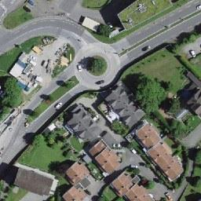 | 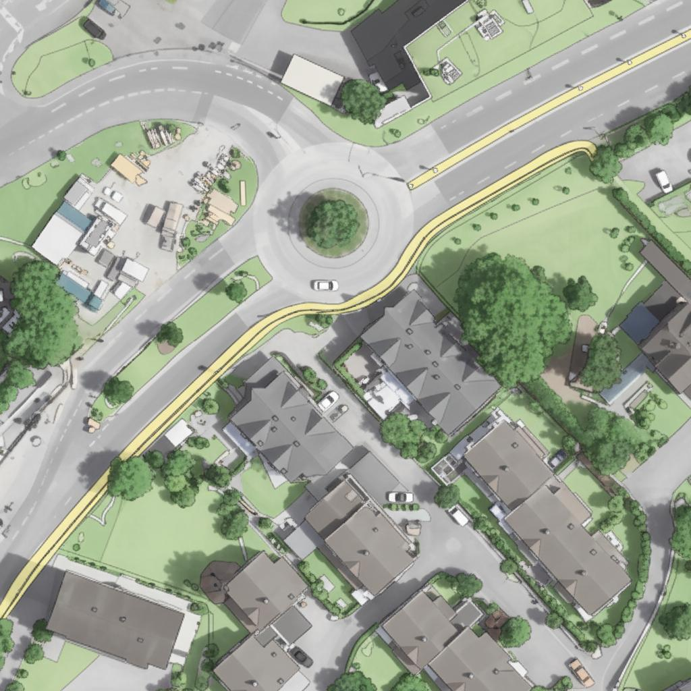 | aerial imagery not interpreted |
| 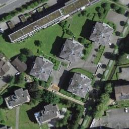 | 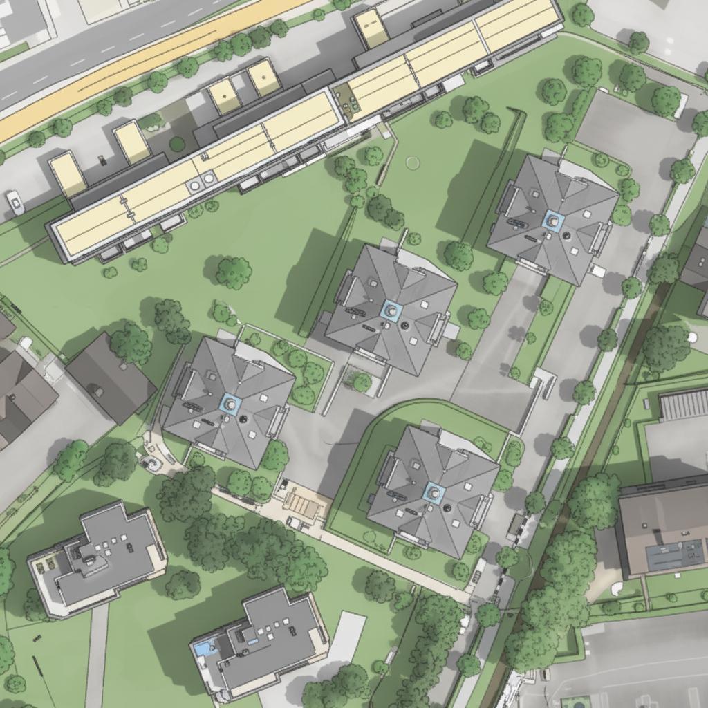 |  |
| 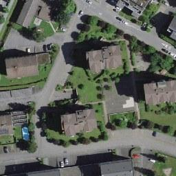 |  |  |
| 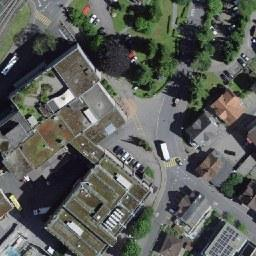 |  | small river interpreted|
| 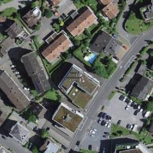 | 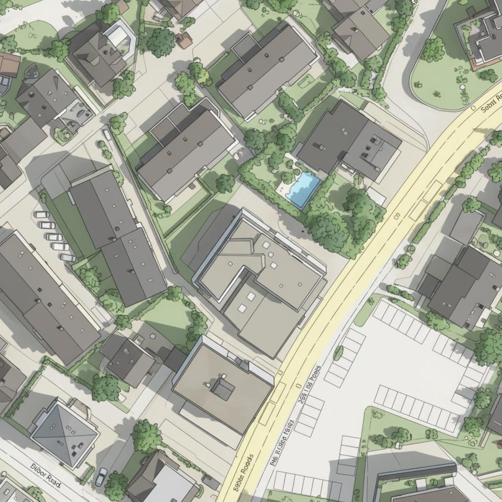 | |
|  |  | Soccer court invented |
| 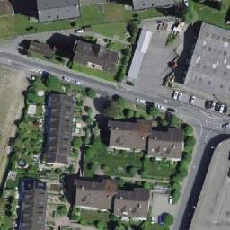 |  |  |
|  | 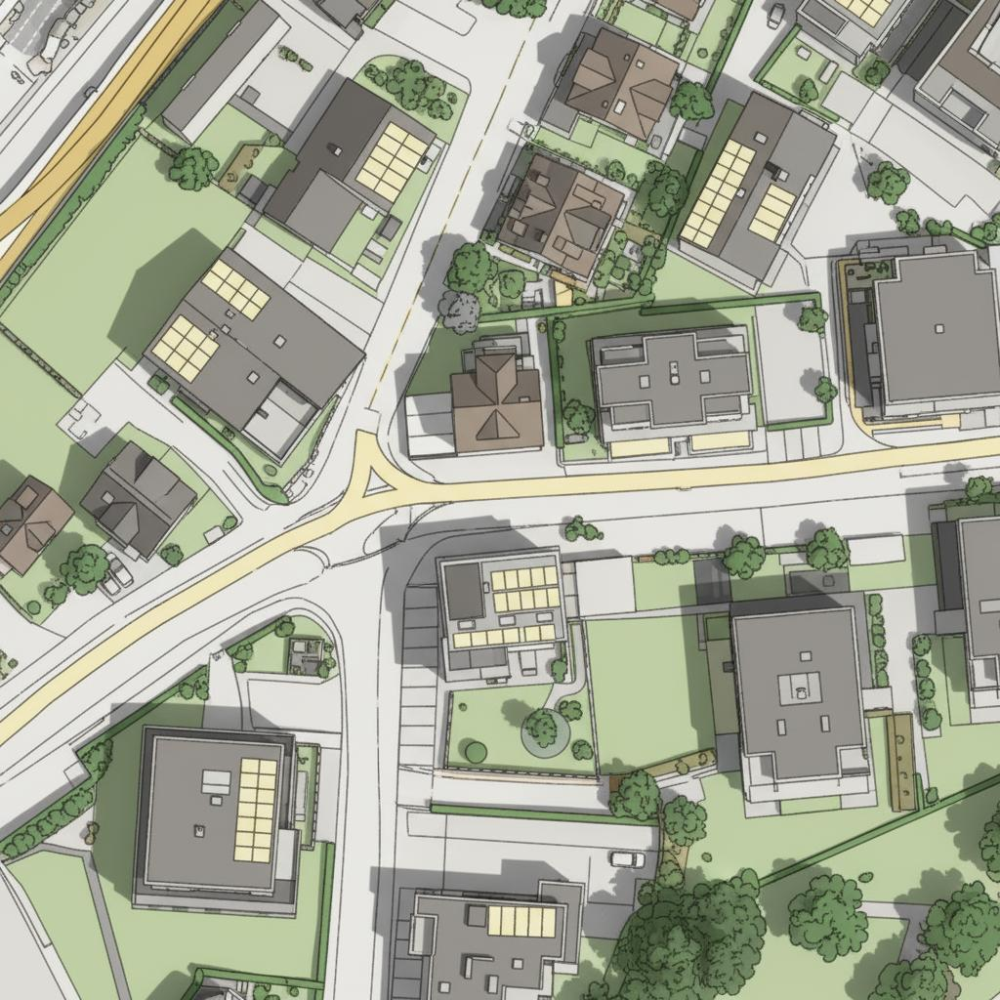 | shadow is somehow stronger |
| 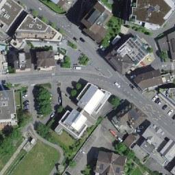 | 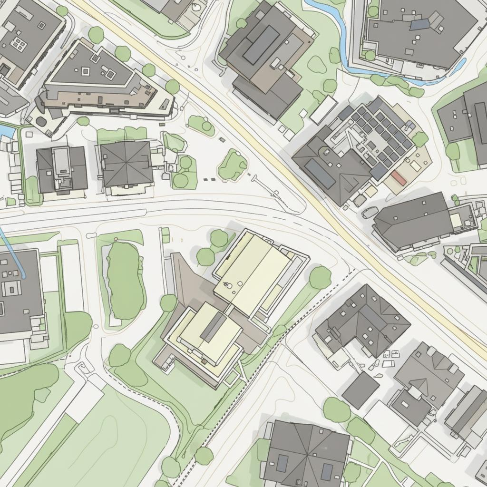 |  |
|  |  | aerial imagery not completely interpreted|
|  |  | aerial imagery not interpreted|
| 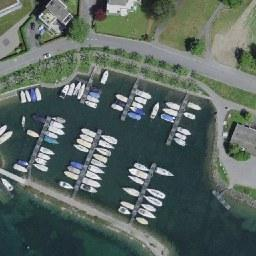 |  | artificial bathymetry |
|  |  | aerial imagery not completely interpreted|
|  | 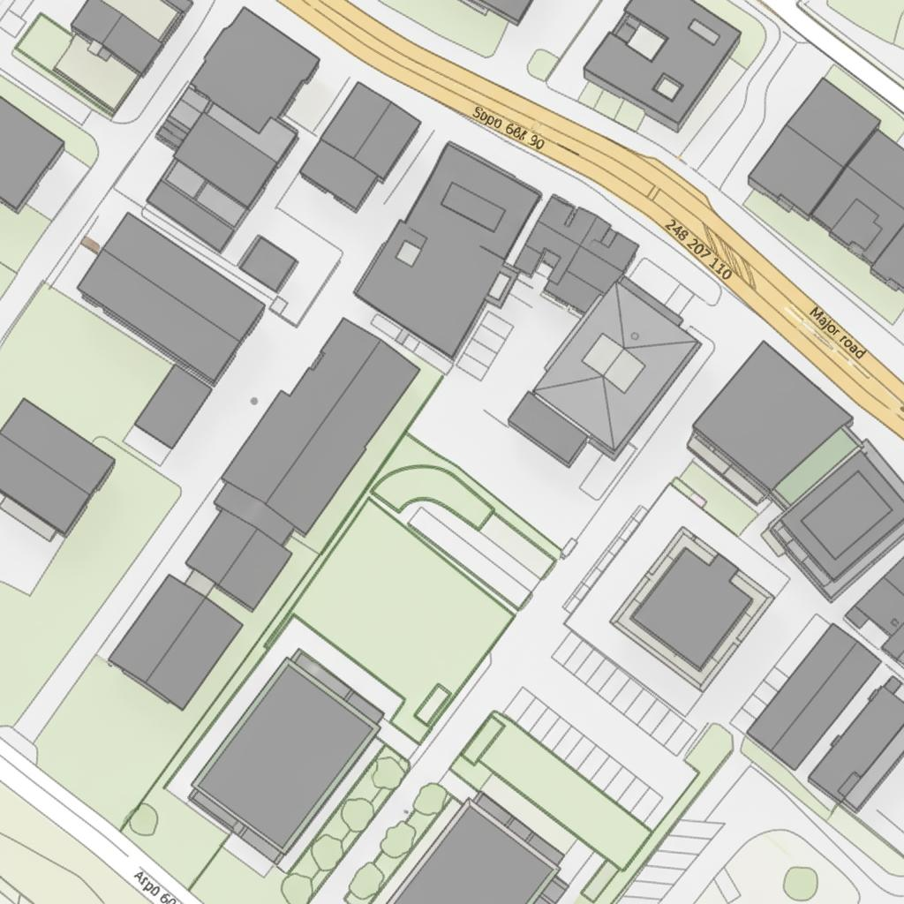 | trees missing |
|  | 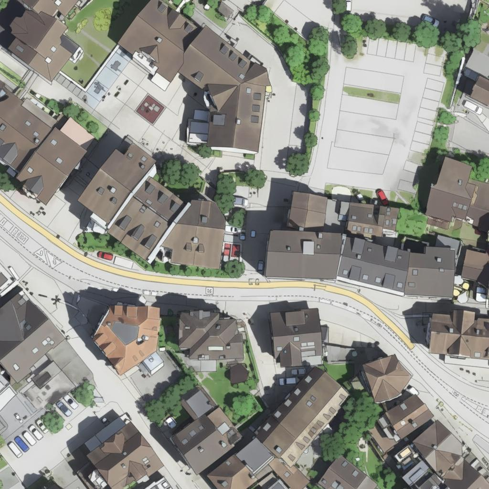 | aerial imagery not interpreted |

## Technical Approach

### Technology Stack

- **AI Model**: Google Gemini (Nano Banana) - available in free tier
- **Data Source**: [swisstopo SWISSIMAGE WMTS](https://api3.geo.admin.ch/services/sdiservices.html#wmts)
- **Coordinate System**: Swiss LV95 (EPSG:2056)
- **Optimal Scale**: Zoom level 26 (~1:2000 scale)

### Workflow

1. **Define Area in Switzerland**: [Draw a polygon](https://www.geo.admin.ch/en/map-viewer-functions-drawing-and-measuring) on [map.geo.admin.ch](https://map.geo.admin.ch) and grab the [link to the KML](https://www.geo.admin.ch/en/map-viewer-functions-drawing-and-measuring#Share,-export-and-further-edit-drawings)
2. **Download Tiles**: Script fetches WMTS tiles (256×256 px) covering the area. swisstopo data are [open](https://www.swisstopo.admin.ch/en/free-geodata-ogd)
3. **AI Processing**: Each tile is processed through Gemini with a custom cartographic [prompt](prompt.txt) based on  swisstopo's [Basemap Style](https://api.geo.admin.ch/services/sdiservices.html#getstyle)
4. **Output**: Generated map tiles saved alongside original aerial photos

### Why Tile-Based Processing?

Gemini's Nano Banana model has AFAIK an input limit of 1024×1024 pixels. Breaking large areas into WMTS tiles (256×256 px at zoom 26) allows:
- Processing of arbitrarily large regions
- Staying within API constraints
- Maintaining sufficient detail 

## Prerequisites

Before you begin, ensure you have:

- **Python 3.8+** installed on your computer
- A **Google account** for API access
- Basic familiarity with running Python scripts (no coding knowledge required)

## Installation Guide

### Step 1: Get Your API Key

1. Visit [Google AI Studio](https://aistudio.google.com/)
2. Sign in with your Google account
3. Click **"Get API key"** in the sidebar
4. Create a new API key (choose "Create API key in new project")
5. **Important**: Enable billing if prompted (free tier available, but billing must be configured)
6. Copy your API key 

### Step 2: Download This Repository

```bash
# Clone the repository
git clone https://github.com/yourusername/ai-topographic-maps.git
cd ai-topographic-maps
```

Or download as ZIP and extract to a folder.

### Step 3: Install Required Libraries

Open a terminal/command prompt in the project folder and run:

```bash
pip install google-genai pillow pyproj requests
```

### Step 4: Set Up Your API Key

1. Create a folder named `secrets` in the project directory
2. Inside `secrets`, create a text file named `genai_key.txt`
3. Paste your API key into this file (nothing else, just the key)
4. Save and close the file

**Your folder structure should look like:**
```
ai-topographic-maps/
├── style_transfer_swissimage.py
├── prompt.txt
├── secrets/
│   └── genai_key.txt
└── README.md
```

### Step 5: Define Your Map Area

1. Go to [map.geo.admin.ch](https://map.geo.admin.ch)
2. Click the **drawing tools** (pencil icon)
3. Draw a polygon around your desired area
4. Click **"Share"** → Copy the link
5. Extract the KML URL from the link (looks like: `https://public.geo.admin.ch/api/kml/files/...`)
6. Open `style_transfer_swissimage.py` in a text editor
7. Find the line with `kml_url = "https://public.geo.admin.ch/..."` 
8. Replace with your KML URL

**Tip**: Start with a small area (a few city blocks) for your first test!

## Running the Script

### Basic Usage

Open terminal in the project folder and run:

```bash
python style_transfer_swissimage.py
```

### What Happens Next

The script will:
1. Download and parse your KML area
2. Calculate required map tiles
3. Download aerial photos from swisstopo
4. Process each tile through Gemini AI
5. Save results to `output_tiles/` folder

**Processing time**: ~5-10 seconds per tile (depending on API response time)

### Output Files

Generated files are saved in the `output_tiles/` directory:

- `{col}_{row}.jpeg` - Original aerial photo
- `{col}_{row}_map.jpeg` - AI-generated topographic rendering

## Customizing the Prompt

The cartographic style is defined in `prompt.txt`. You can edit this file to:

- Change color schemes
- Adjust symbol styles
- Add/remove map features
- Modify abstraction levels

**Example prompt snippet:**
```
Transform this aerial photograph into a Swiss topographic map style:
- Buildings: Light gray with subtle shadows
- Roads: Yellow for main roads, white for minor roads
- Vegetation: Green gradients based on density
- Water: Light blue with darker outlines
...
```

## ⚡ Tips & Best Practices

### For Best Results

- **Start small**: Test with 4-9 tiles before processing large areas
- **Optimal scale**: Zoom level 26 works best (~1:2000)
- **Check API limits**: Free tier has daily quotas - monitor usage
- **Iterate prompts**: Experiment with different style instructions

### Troubleshooting

**Error: 429 RESOURCE_EXHAUSTED**
- You've hit API rate limits. Wait 1 minute and try again
- Check billing is enabled in Google Cloud Console

**Error: No coordinates found in KML**
- Verify your KML URL is correct
- Ensure you drew a polygon (not just a marker) on map.geo.admin.ch

**Poor quality results**
- Try adjusting the prompt in `prompt.txt`
- Ensure zoom level 26 is being used
- Check that original tiles downloaded correctly

## Future Improvements

Potential enhancements for more robust results:

- [ ] Add hillshade/terrain as background layer
- [ ] Implement post-processing for consistency across tiles
- [ ] Better automatic removal of cars and transient objects
- [ ] Batch processing with progress indicators
- [ ] Quality metrics for generated tiles
- [ ] Mosaic stitching for seamless map output
- [ ] Support for multiple style presets
- [ ] Web interface for non-technical users

## Related Resources

- [Original LinkedIn Post](https://www.linkedin.com/feed/update/urn:li:activity:7379129420801875968/)
- [swisstopo WMTS API Documentation](https://api3.geo.admin.ch/services/sdiservices.html#wmts)
- [Google Gemini API - Image Generation](https://ai.google.dev/gemini-api/docs/image-generation#3_style_transfer)
- [Swisstop BaseMaps (for style reference)](https://www.swisstopo.admin.ch/en/web-maps-base-map)

## Contributing

Contributions are welcome! Areas particularly helpful:

- Improving prompt engineering for better consistency
- Developing post-processing algorithms for tile harmonization
- Creating quality assessment metrics
- Adding support for different cartographic styles


## Acknowledgments

- **swisstopo**: For providing excellent WMTS aerial imagery services
- **Google**: For making Gemini AI accessible through free tier
- **Community**: For inspiration and feedback on initial experiments

## Contact

Questions or feedback? [Open an issue](https://github.com/yourusername/ai-topographic-maps/issues) or reach out on [LinkedIn](https://www.linkedin.com/in/davidoesch).

---

*Note: This is an experimental project exploring AI capabilities in cartography. Generated maps are for research and visualization purposes, not for official or navigation use.*